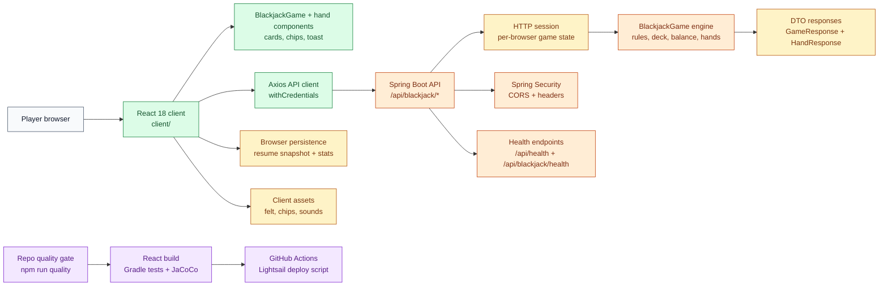
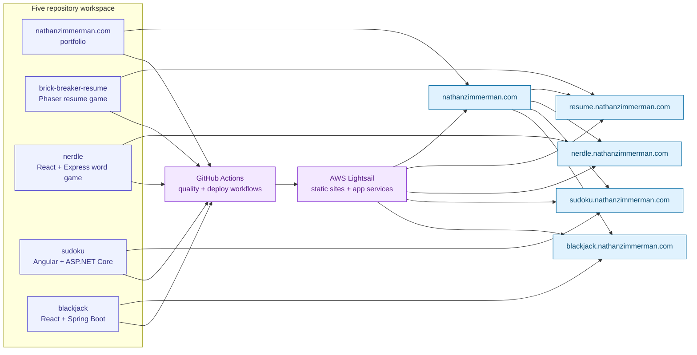

# Architecture

## Runtime Topology

Blackjack is a full-stack game with a React client in `client/` and a Spring Boot API in `server/`. The browser calls the `/api/blackjack/*` endpoints with credentials enabled so the backend can keep round state in the HTTP session.

## Architecture Diagram

## Source Boundaries

The client owns rendering, browser persistence, audio/asset presentation, and API request shaping. The server owns Blackjack rules, balance changes, hand transitions, validation, security headers, CORS, and the session-backed game snapshot returned to the UI.

## Quality Gates

Run `npm run quality` from the repo root after installing root and client npm dependencies. The gate checks Prettier formatting, client Jest coverage, the client production build, and Gradle/JUnit tests with JaCoCo coverage verification.

## Deployment Flow

GitHub Actions runs the root quality gate for pull requests and pushes to `main`. Pushes to `main` then SSH to Lightsail and run the external deploy script for this repository, followed by frontend and backend health checks.

## Workspace Connectivity

## Deferred Architecture Follow-Ups

Keep CRA-to-Vite migration separate from this consistency pass. If the app grows, consider introducing a typed API contract between React and Spring Boot and a Java formatter in a later dedicated change.
